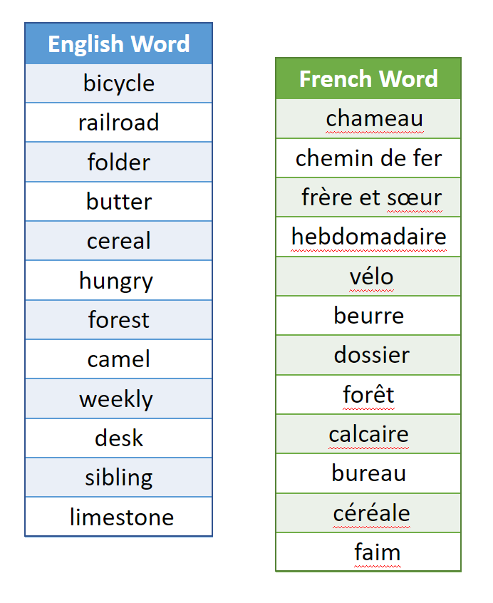
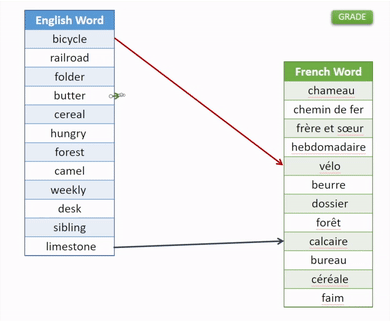

  
    

# Skill Assessment: Full-Stack Engineer

## Background

:clap: A sincere congratulations on progressing your candidacy for the Full-Stack Engineer role at Cascade Debt! This role is essential for building and integrating how users interact with their own data artifacts. Your duties will largely cover design, implementation, and development of Cascade's UI and API. As such, we'd love for you to show off your front-end and dev-ops skillsets to us! :sunglasses:

For this final assessment, we ask you to please build and containerise a very simple React app addressing the problem below. Ensure that: (a) you have it cloned to a git-based sharable public repository, (b) you have a README.md file in the repository's root discussing your technical design and choices, and (c) you have a working Dockerfile to container and host your app. You may use your preference for the app's framework (e.g. Express, Nest, Meteor, Koa), however it should be in TypeScript.

---

## Problem: Word Memory

<table>
  <tr>
    <td> </td>
    <td width=450px> 
        A popular children's game is "Memory" - in which the player needs to find matching visual cards. Your task today is an homage to this game - instead of matching pictures, you'll match words!
    </td>
  </tr>
</table>

The French government has recently contracted your firm to build a language training app for their "visiting American friends".

1. Name your app - give it a nice little splash page with a "GO!" button. 

2. After pressing "GO!", change the state of the button to "GRADE" (see step #4) below. 

3. Also, after pressing "GO!", your app must scramble the following key-value dictionary: 
<table align='center'>
    <tr>
        <th> English Word </th><th> French Word </th>
    </tr><tr>
        <td>forest</td><td>forêt</td>
    </tr><tr>
        <td>sibling</td><td>frère et sœur</td>
    </tr><tr>
        <td>cereal</td><td>céréale</td>
    </tr><tr>
        <td>desk</td><td>bureau</td>
    </tr><tr>
        <td>camel</td><td>chameau</td>
    </tr><tr>
        <td>butter</td><td>beurre</td>
    </tr><tr>
        <td>bicycle</td><td>vélo</td>
    </tr><tr>
        <td>railroad</td><td>chemin de fer</td>
    </tr><tr>
        <td>folder</td><td>dossier</td>
    </tr><tr>
        <td>weekly</td><td>hebdomadaire</td>
    </tr><tr>
        <td>hungry</td><td>faim</td>
    </tr><tr>
        <td>limestone</td><td>calcaire</td>
    </tr>
</table>

After randomising, use React components to present the key-value scramble into two separated columns - something like this: 

3. The goal of this app is then for the user to match the English words to the French words. Build and implement a user-interaction component that does so: e.g. a drag line or similar. As an example, something like this: 

4. Upon user click on the "GRADE" button: (a) display the total percentage correct, (b) changes "GRADE" to "GO!" - e.g. reset back to Step #2.

5. [Dockerise your build so all your package dependencies are addressed](https://nodejs.org/en/docs/guides/nodejs-docker-webapp/) - please include the `Dockerfile` in your submission, as well as your `docker run` command to launch your app.

---

## Submission

- **Ensure that your project runs fully BEFORE submission!**

- Verify that you have dockerised your app, and you are confident with your deploy. 

- Push and merge into your git repository's main branch.

- Submit your project's git repository URL to either the Rippling comms channel or via email to `assessments@cascadedebt.com`.
